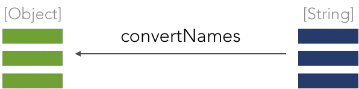
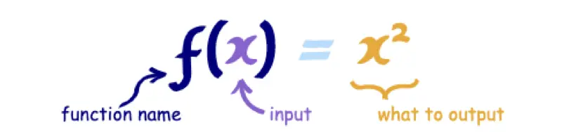
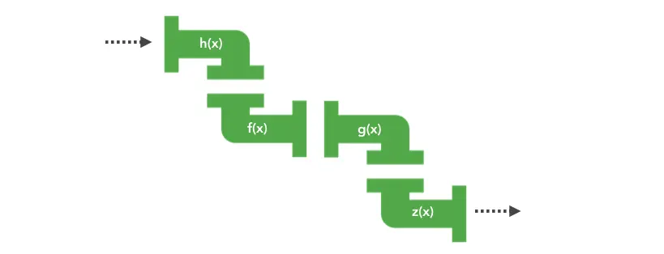
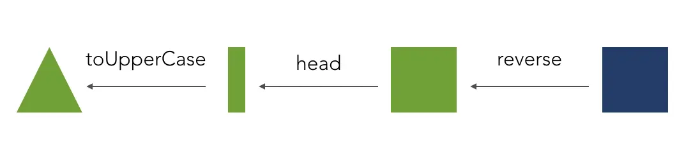

### 前言

早在 1950 年代，随着 Lisp 语言的创建，函数式编程（Functional Programming，简称 FP）就已经开始出现在大家视野。直到近些年，函数式以其优雅、简单的特点开始重新风靡整个编程界，主流语言在设计的时候无一例外都会更多地参考函数式特性，Java8 开始支持函数式编程。

而在前端领域，同样能看到很多函数式编程的影子：ES6 新增了箭头函数，Redux 引入 Elm 思路降低 Flux 的复杂性，React16.6 开始推出 React.memo()，使 pure functional components 成为可能，16.8 开始主推 Hook，建议使用 pure function 编写组件......

这些无一例外地说明，函数式编程这种古老的编程范式并没有随着岁月而褪去其光彩，反而愈加生机勃勃。

### 初窥

概念说的再多，不如例子直观。假设现在有这么个需求，有一组人名存在数组中，现在需要对这个结构进行一些修改，把字符串数组变成一个对象数组以方便后续扩展，并对人名做一些转换处理：

```javascript
// before
["john-reese", "harold-finch", "sameen-shaw"];

// after
[{ name: "John Reese" }, { name: "Harold Finch" }, { name: "Sameen Shaw" }];
```

#### 命令式

命令式编程是一种关注实现过程的编程范式：

1. 定义一个临时变量 newArr。
2. 循环遍历数组。
3. 在遍历的过程中，通过 - 切割字符串
4. 将名字的首位取出来大写，然后拼接剩余的部分。
5. .......
6. 最后得到结果。

代码实现如下：

```javascript
const arr = ["john-reese", "harold-finch", "sameen-shaw"];
const newArr = [];
for (let i = 0, len = arr.length; i < len; i++) {
  let name = arr[i];
  let names = name.split("-");
  let newName = [];
  for (let j = 0, naemLen = names.length; j < naemLen; j++) {
    let nameItem = names[j][0].toUpperCase() + names[j].slice(1);
    newName.push(nameItem);
  }
  newArr.push({ name: newName.join(" ") });
}
return newArr;
```

命令式编程虽然能完成任务，但是却不易于维护。过程中掺杂了大量逻辑，需要从头读到尾才能知道具体做了什么，一旦出现问题很难定位。

#### 函数式

下面是函数是编程的思路：

1. 需要一个函数将 `String 数组` 转换成 `Object 数组`。  
   
2. 需要一个实现将 `String` 转换成 `Object`。
   
3. 由于字符串的格式并不统一，所以可以先统一字符串格式，再来实现转换。
   
4. 统一字符格式的 `capitalizeName` 可以是几个方法的组合，每个方法负责一部分的处理逻辑（`split`, `join`, `capitalize`）。
   

至此，基本思路分析完成，下面是代码：

```javascript
// 先忽略 curry 和 compose
const capitalize = (x) => x[0].toUpperCase() + x.slice(1).toLowerCase();

const genObj = curry((key, x) => {
  let obj = {};
  obj[key] = x;
  return obj;
});

const capitalizeName = compose(join(" "), map(capitalize), split("-"));
const convert2Obj = compose(genObj("name"), capitalizeName);
const convertName = map(convert2Obj);

convertName(["john-reese", "harold-finch", "sameen-shaw"]);
```

不难发现，函数式编程的思维过程和命令式编程差别很大，它并不着重于具体的实现过程，它的着眼点是**函数**。它强调的是如何通过函数的组合变换去解决问题，而不是通过写什么样的语句去解决问题。当代码量级越来越大是，函数式编程这种拆分和组合的方式会带来极大的便利。

### 理念

前面我们已经初窥了函数式编程，简单体验了下它的思路，现在让我们来看看函数式编程到底是什么。

“函数”这个东西在我们很小的时候就已经开始接触了，一元函数、二元一次函数等等。根据学术上的定义，函数是一种描述集合与集合之间的转换关系，每一个输入通过函数之后都会返回一个输出值。



所以，**函数**本质上是一个**关系**，或者说是一种**映射**。而这种映射关系是可以组合的：如果一个函数的输出类型可以匹配另一个函数的输入类型要求，那么它们就可以组合在一起。

```javascript
const convert2Obj = compose(genObj("name"), capitalizeName);
```

前面写的 `convert2Obj` 就完成了映射关系的组合，实现了数据从 `String -> String -> Object` 的转换流程。这种映射关系的组合就相当于数学上的复合运算：`y = g(f(x))`。

在代码世界中，需要我们处理的其实也就是“数据”和“关系”，而关系就是函数。所谓的**编程**其实就是在寻找一种**映射关系**，一旦找到了关系，问题也就解决了，剩下的工作也就是让数据流过这种关系，然后转换成另一个数据罢了。

这其实非常像**流水线**，把输入当原料，把输出当产品。**数据可以不断地从一个函数的输入口进入，然后从输出口输出，接着又再次流向另一个函数的输入口。如此往复，直到最后得到我们想要的输出结果。**



<span style="color: #2673dd">函数式编程是什么？它是一种强调在编译过程中把更多的关注点放在如何去构建关系的编程范式。</span>通过构建一条高效的构建流水线，一次性解决所有问题，而不是把精力分散在不同的加工厂中来回奔波传递数据。


### 特点

函数式编程有如下特点：

#### 一等公民

函数是一等公民，这是函数式编程得以实现的前提。具体来说，这个特性表示函数和其他数据类型一样，处于平等地位。函数可以赋值给变量，也可以作为参数传入另一个函数，或者作为一个函数的返回值。就像前面的例子一样：

```javascript
const convert2Obj = compose(genObj("name"), capitalizeName);
```

#### 声明式编程

不难看到，函数式编程大多时候都是在描述需要做什么，而不是怎么去做，这种编程风格被称为声明式编程。因为声明式代码大多都是接近自然语言的，所以它的代码可读性很高。此外，由于关注结果而不是具体过程，声明式编程也非常方便开发人员进行分工协作。

`SQL` 语句就是典型的声明式编程，我们无需关注 `select` 语句是如何实现的，只需要知道可以通过它找到我们所需要的数据。`React` 使用的也是声明式编程，我们只需要描述 `ui`，至于状态变化之后 `ui` 如何更新，`React` 会在运行时自动处理。

#### 惰性执行

函数只在需要的时候执行，不会产生无意义的中间变量。以前面的例子来说，函数式编程跟命令式编程最大的区别就在于几乎没有中间变量，它从头到尾都在写函数，只有在最后的时间才通过调用 `convertName` 产生实际的结果。

#### 无状态和不可变数据

这是函数式编程的核心概念：

- 无状态：对于一个函数，不管什么时候运行，它都应该像第一次运行一样，只要输入相同，那么输出也相同，完全不依赖外部状态的变化。

- 不可变数据：所有数据都是不可变的，如果想要修改一个对象，那么应该先创建一个新的对象用来修改，而不是直接修改现有对象。

为了实现这两个特点，<span style="color: #2673dd">函数式编程提出函数应该具备两个特性：无副作用、纯函数。</span>


#### 无副作用

副作用的含义：在完成函数主要功能的过程中实现的其他副要功能。函数最主要的功能是根据输入返回输出结果，在函数中最常见的副作用是随意操纵外部变量，例如：

```javascript
// map 函数的功能原本是根据一个函数在输入数组的基础上创建一个新的数据，
// 但是这里却修改了输入数据，函数的主要输出功能没了，全是副作用。
const list = [...];
list.map((item) => {
   item.type = 1;
   item.age ++;
})
```

保证函数没有副作用，一来可以保证数据的不可变性，二来可以避免很多因为共享状态带来的问题。一个人维护代码时效果可能还不明显，但是随着项目的迭代，项目参与人数的增加，大家对同一变量的依赖和饮用越来越多，这种问题会越来越严重，最终导致维护者自己都不清楚变量到底是在哪里被改变而产生 BUG。

#### 纯函数

纯函数是在“无副作用”的要求上更进一步，它也是[Redux 三大原则](https://redux.js.org/understanding/thinking-in-redux/three-principles)（单一数据来源，状态只读，使用纯函数修改状态）之一。纯函数的概念很简单，只有如下两点：

- 不依赖外部状态（无状态）：函数的运行结果不依赖全局变量、this 指针、IO 操作等。
- 无副作用（数据不变）：不修改全局变量，不修改入参。

**纯函数是真正意义上的“函数”，它意味着相同的输入，永远会得到相同的输出。**

下面是个非纯函数例子：

```javascript
const curUser = {
  name: "Peter",
};

const saySth = (str) => curUser.name + ": " + str; // 引用了全局变量
const changeName = (obj, name) => (obj.name = name); // 修改了输入参数
changeName(curUser, "Jay"); // { name: 'Jay' }
saySth("hello!"); // Jay: hello!
```

修改成纯函数如下：

```javascript
const curUser = {
  name: "Peter",
};

const saySth = (user, str) => user.name + ": " + str; // 不依赖外部变量
const changeName = (user, name) => ({ ...user, name }); // 未修改外部变量
saySth(changeName(curUser, "Jay"), "hello!"); // Jay: hello!
```

纯函数的意义：

- **便于测试和优化**：这个意义在实际项目开发中意义非常大，由于纯函数对于相同的输入永远会返回相同的结果，因此可以轻松地断言函数的执行结果，同时也能保证函数的优化不会影响到其他代码的执行。这十分符合测试驱动开发（Test-Driven Development）的思想，这样产生的代码往往健壮性更强。
- **可缓存性**：由于相同的输入总是可以返回相同的数据，所以可以提前缓存函数的执行结果。有很多库有所谓的 `memoize` 函数，下面是一个简化版的 `memoize` 例子：

  ```javascript
  function memoize(fn) {
    const cache = {};
    return function () {
      const key = JSON.stringify(arguments);
      var value = cache[key];
      if (!value) {
        value = [fn.apply(null, arguments)]; // 放在一个数组中，方便应对 undefined，null 等异常情况
        cache[key] = value;
      }
      return value[0];
    };
  }

  const fibonacci = memoize((n) =>
    n < 2 ? n : fibonacci(n - 1) + fibonacci(n - 2)
  );
  console.log(fibonacci(4)); // 执行后缓存了 fibonacci(2), fibonacci(3),  fibonacci(4)
  console.log(fibonacci(10)); // fibonacci(2), fibonacci(3),  fibonacci(4) 的结果直接从缓存中取出，同时缓存其他的
  ```

- **自文档化**：由于纯函数没有副作用，所以它的依赖很明确，也因此更容易观察和理解。
- **更少的 BUG**：使用穿函数意味着不会存在指向不明的 this，不会存在对全局变量的引用，不会存在对参数的修改，而这些共享状态往往是大多数 BUG 的源头。

### 流水线构建

如果说函数式编程中有两种操作是必不可少的，那无疑就是 **柯里化(Currying)** 和 **函数组合(Compose)**。前者可以理解为流水线上的加工站，后者则是流水线(由多个加工站组成)。

接下来，看下如何在 JS 里利用函数式编程的思想去组装一套高效的流水线。

#### 加工站 —— 柯里化

柯里化的意思是将一个多元函数，转换成一个依次调用的单元函数。

```javascript
f(a, b, c) -> f(a)(b)(c)
```

下面是个 `curry` 版本的 `add` 函数：

```javascript
var add = function (x) {
  return function (y) {
    return x + y;
  };
};

const increment = add(1);

increment(10); // 11
```

为什么这个单元函数很重要？还记得前面提到的函数的返回值有且只有一个嘛？如果想顺利地组装流水线，那就必须保证每个加工站的输出刚好能流向下个工作站的输入。因此，在流水线上的加工站必须都是单元函数。

现在很好理解为什么柯里化配合函数组合有奇效了，因为柯里化处理的结果刚好就是单输入的。

##### 部分函数应用 vs 柯里化

部分函数应用强调的是固定一定的参数，返回一个更小元的函数。柯里化强调的是生成单元函数。

```javascript
// 柯里化
f(a, b, c) -> f(a)(b)(c)
// 部分函数调用
f(a, b, c) -> f(a)(b, c) || f(a, b)(c)
```

生活中常用的多是部分函数调用，这样的好处是可以固定参数，降低函数通用型，提高函数的适合用性。

```javascript
// 假设一个通用的请求 API
const request = (type, url, options) => ...
// GET 请求
request('GET', 'http://....')
// POST 请求
request('POST', 'http://....')

// 但是通过部分调用后，我们可以抽出特定 type 的 request
const get = request('GET');
get('http://', {..})
```

##### 高级柯里化

通常我们不会自己去写 `curry` 函数，现成的库大多都提供了 `curry` 函数的实现，但是使用过的人肯定有会有疑问，`Lodash`，`Ramda` 这些库中实现的 `curry` 函数的行为好像和柯里化不太一样，他们看起来像是部分函数应用。

```javascript
const add = R.curry((x, y, z) => x + y + z);
const add7 = add(7);
add7(1, 2); // 10
const add1_2 = add(1, 2);
add1_2(7); // 10
```

其实，这些库中的 `curry` 函数都做了很多优化，他们实现的柯里化不是纯粹的柯里化，可以理解成“高级柯里化”。这些实现方案会根据输入的参数个数，返回一个柯里化函数或者直接返回一个结果值。即，如果给的参数个数满足了函数条件，则直接返回结果值。这样可以解决一个问题：如果一个函数是多输入，可以避免使用 `(a)(b)(c)` 这种形式传参。

所以上面的 `add7(1, 2)` 能直接输出结果不是因为 add(7) 返回了一个接受 2 个参数的函数，而是刚好传了 2 个参数，满足了所有参数，因此直接返回了计算结果。

##### 柯里化的应用

通常，在实践中使用柯里化都是为了把某个函数变成单值化，这样可以增加函数的多样性，使其适用性更强：

```javascript
const replace = curry((a, b, str) => str.replace(a, b));
const replaceSpaceWith = replace(/\s*/);
const replaceSpaceWithComma = replaceSpaceWith(",");
const replaceSpaceWithDash = replaceSpaceWith("-");
```

通过上面这种方式，从一个 replace 函数中产生很多新函数，这些新函数可以在各种场合进行使用。

#### 流水线 —— 函数组合

前面通过 `curry` 已经可以轻松地搭建出一个加工站了，现在该是组合成流水线的时候了。

##### 概念

函数组合的目的是将多个函数组合成一个函数。下面是一个简化版的实现：

```javascript
const compose = (f, g) => (x) => f(g(x));

const f = (x) => x + 1;
const g = (x) => x * 2;
const fg = compose(f, g);
fg(1); // 3
```

可以看到 `compose` 实现了一个简单的功能：形成了一个全新的函数，而这个函数就是一条从 `g -> f` 的流水线。同时也不难发现 `compose` 是满足结合律的。

```javascript
compose(f, compose(g, t)) = compose(compose(f, g), t)  = f(g(t(x)))
```

只要顺序一样，最后的结果就是一样的。因为可以搞个更高级的 `compose`，支持多个函数组合：

```javascript
compose(f, g, t) => x => f(g(t(x)))
```

简单实现如下：

```javascript
const compose =
  (...fns) =>
  (...args) =>
    fns.reduceRight((val, fn) => fn.apply(null, [].concat(val)), args);

const f = (x) => x + 1;
const g = (x) => x * 2;
const t = (x, y) => x + y;

let fgt = compose(f, g, t);
fgt(1, 2); // 3 -> 6 -> 7
```

##### 应用

一个小需求：将数组最后一个元素大写，假设存在 `log`，`head`，`reverse`，`toUpperCase` 这些函数。

命令式写法：

```javascript
log(toUpperCase(head(reverse(arr))));
```

面向对象写法：

```javascript
arr.reverse().head().toUpperCase().log();
```

链式调用看起来清晰顺眼多了，但是原型链上可供调用的函数式有限的，而需求是无限的。

函数组合写法：

```javascript
const upperLastItem = compose(log, toUpperCase, head, reverse);
```

通过参数可以清晰地看出 `upperLastItem` 做了什么工作，它完成了一套流水线。所有经过这条流水线的参数都会经历：`reverse -> head -> toUppercase -> log` 这些函数的加工，最后生成结果。


更完美的是，这些函数都是非常简单的纯函数，我们可以进行随意的组合，随意使用，不用有任何的顾忌。

> PS. 函数组合的概念和管道很想，只是 pipe 执行方向是 left -> right，而 compose 是 right -> left

##### 好处

函数组合的好处显而易见，它让代码变得简单而富有可读性，同时通过不同的组合方式，可以轻易组合出其他常用函数，让代码更具表现力。

```javascript
// 组合方式 1
const last = compose(head, reverse);
const shout = compose(log, toUpperCase);
const shoutLast = compose(shout, last);

// 组合方式 2
const lastUppder = compose(toUpperCase, head, reverse);
const logLastUpper = compose(log, lastUppder);
```

这个过程，就像搭乐高积木一样。


由此可见，大型程序都可以通过这样一步步的拆分组合实现，而剩下要做的，就是去构造足够多的积木块（函数）。

### 总结

函数式编程的优点：

- **代码简洁，开发快速**：函数式编程大量使用函数的组合，函数的复用率很高，减少了代码的重复，因此程序比较短，开发速度较快。Paul Graham 在《黑客与画家》一书中写道：同样功能的程序，极端情况下，Lisp 代码的长度可能是 C 代码的二十分之一。
- **接近自然语言，易于理解**：函数式编程大量使用声明式代码，基本都是接近自然语言的，加上它没有乱七八糟的循环，判断的嵌套，因此特别易于理解。
- **易于"并发编程"**：函数式编程没有副作用，所以函数式编程不需要考虑“死锁”（Deadlock），所以根本不存在“锁”线程的问题。
- **更少的出错概率**：因为每个函数都很小，而且相同输入永远可以得到相同的输出，因此测试很简单，同时函数式编程强调使用纯函数，没有副作用，因此也很少出现奇怪的 Bug。

函数式编程的缺点：

- **性能**：函数式编程相对于指令式编程，性能绝对是一个短板，因为它往往会对一个方法进行过度包装，从而产生上下文切换的性能开销。同时，在 JS 这种非函数式语言中，函数式的方式必然会比直接写语句指令慢（引擎会针对很多指令做特别优化）。就拿原生方法 map 来说，它就要比纯循环语句实现迭代慢 8 倍。
- **资源占用**：在 JS 中为了实现对象状态的不可变，往往会创建新的对象，因此，它对垃圾回收（Garbage Collection）所产生的压力远远超过其他编程方式。这在某些场合会产生十分严重的问题。
- **递归陷阱**：在函数式编程中，为了实现迭代，通常会采用递归操作，为了减少递归的性能开销，我们往往会把递归写成尾递归形式，以便让解析器进行优化。但是众所周知，JS 是不支持尾递归优化的（虽然 ES6 中将尾递归优化作为了一个规范，但是真正实现的少之又少）

### 参考资料

[简明 JavaScript 函数式编程——入门篇](https://juejin.cn/post/6844903936378273799)  
[30 秒了解尾递归和尾递归优化](https://juejin.cn/post/6844903798834462733)  
[什么是尾递归？尾递归和普通递归的区别](https://juejin.cn/post/6959549674990600228)
