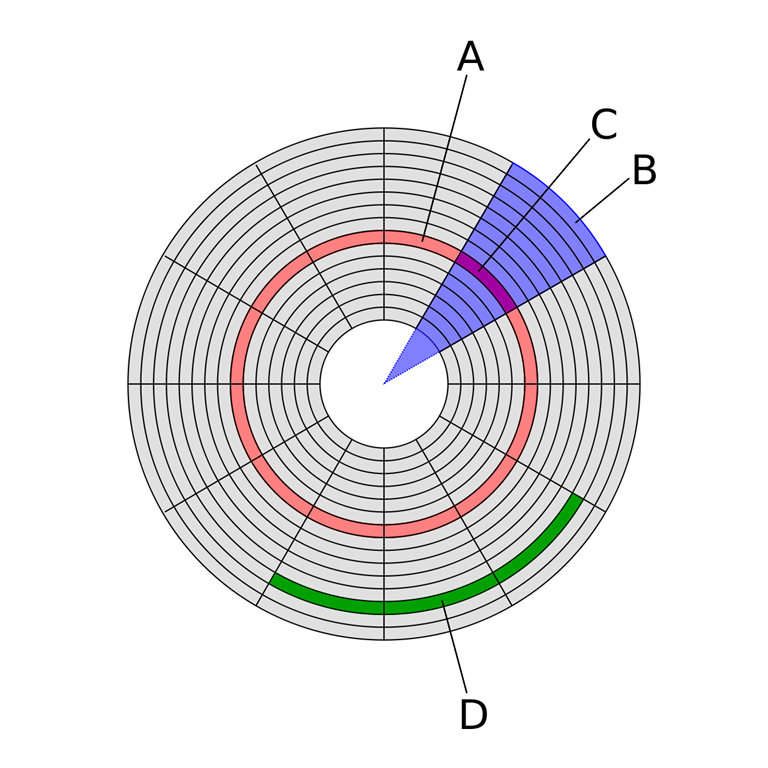

### 磁道、扇区

在计算机磁盘存储中，有多个同心圆刻画在磁盘表面，磁道指的就是这些用于存储数据的环形轨道，扇区则是磁道的细分。扇区是磁盘的最小存储单元，通常是 512 字节或者 4 KB。每个扇区都有着唯一地址，可以通过这个地址来读写扇区内的数据。而由于扇区的空间比较小，当文件稍微大点时，数量众多的扇区会造成高昂的寻址成本，于是操作系统就将相邻的扇区组合在一起，形成一个块(linux)/簇(windows)，再对块/蔟进行整体操作，以此提升读写效率。因此，块/蔟是操作系统中最小的逻辑存储单元。

下面这个是维基百科上的图片，形象地介绍了磁道、扇区等概念：

A：磁盘磁道（红色区域）
B：几何学中的扇形（蓝紫色区域）
C：磁盘扇区（玫红色区域）
D：块/蔟（绿色区域）

### 索引节点

### 参考资料

[存储基础知识：扇区与块/蔟](https://www.cnblogs.com/kerrycode/p/12701772.html)  
[前端开发者应该掌握的软连接和硬链接知识](https://juejin.cn/post/7147922973612048398?searchId=20240712153512A111306524A5B73FE06B)  
[关于现代包管理器的深度思考](https://juejin.cn/post/6932046455733485575)
