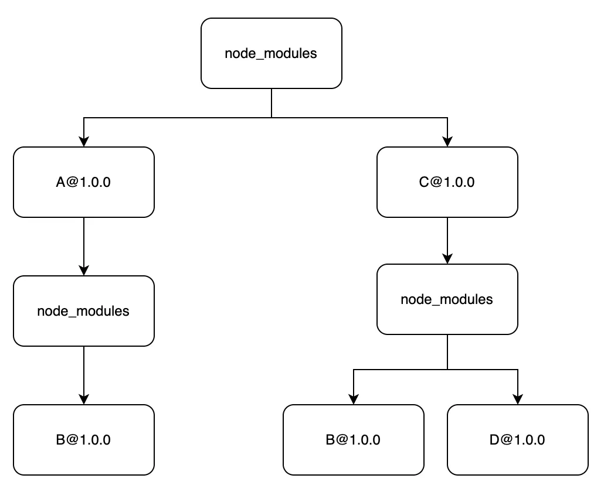

### 前言

前端开发者们每天都在接触 `xxx install`，包管理器是必不可少的工具，在项目开发的过程中难免会引用到各种不同的库，而这些库又依赖其他不同的库，这些依赖应该如何进行管理？

### npm

`npm` 可以说是最早的依赖安装 `cli`，先来简要看下 `npm` 是如何安装依赖的吧。

1. 发出 `npm install` 命令。
2. `npm` 向 `registry` 查询模版压缩包的网址。
3. 下载压缩包，存放在 `~/.npm` 或者 `%LocalAppData%\npm-cache` 目录。
4. 将压缩包解压到当前项目的 `node_modules` 目录。

`npm2` 和 `npm3` 在依赖管理上有所区别，下面分别进行说明。

#### npm2

##### 嵌套地狱

`npm2` 安装依赖的时候比较简单，会直接按照包依赖的树形结构下载并填充到项目本地的目录结构中，也就是**完全嵌套的 node_modules 结构**。直接依赖会平铺在 `node_modules` 下，子依赖会潜逃在直接依赖的 `node_modules` 里。

比如项目依赖了 A 和 C，而 A 和 C 依赖了相同版本的 B@1.0，并且 C 还依赖了 D@1.0，那么此时 `node_modules` 的结构如下：

```shell
node_modules
├── A@1.0.0
│   └── node_modules
│       └── B@1.0.0
└── C@1.0.0
    └── node_modules
        └── B@1.0.0
        └── D@1.0.0
```



可以看到同版本的 B 分别被 A 和 C 各安装了一次。

如果项目的依赖包数量多，依赖层级深，那么久而久之，很容易就会形成嵌套地狱：


#### npm3
