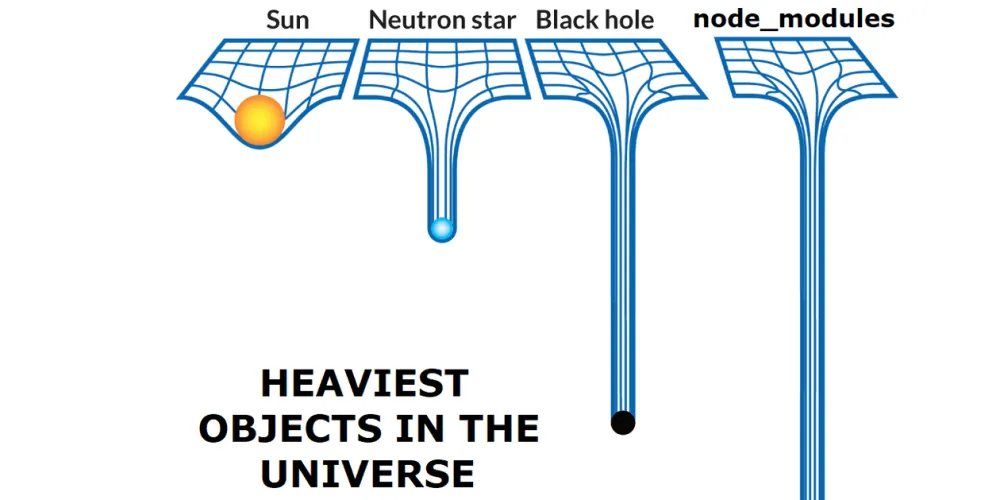
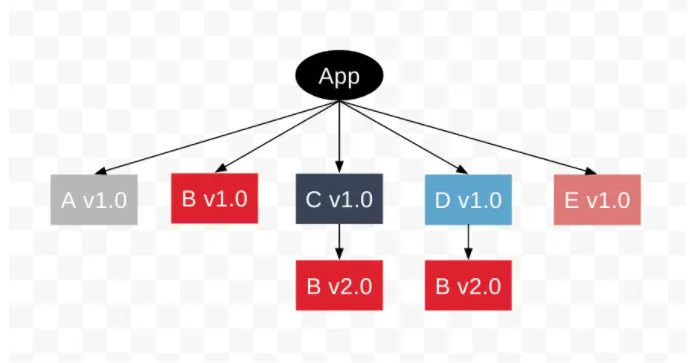
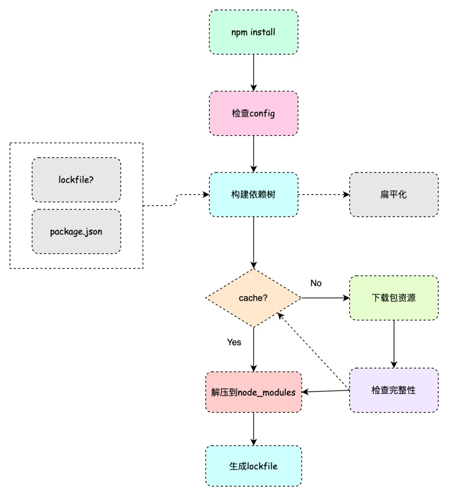

### 前言

前端开发者们每天都在接触 `xxx install`，包管理器是必不可少的工具，在项目开发的过程中难免会引用到各种不同的库，而这些库又依赖其他不同的库，这些依赖应该如何进行管理？

### npm

npm 可以说是最早的依赖安装脚手架，于 2010 年发布，是 nodejs 内置的包管理工具。`npm install` 命令执行的简要过程：

1. 发出 `npm install` 命令。
2. `npm` 向 `registry` 查询模块压缩包的网址。
3. 下载压缩包，存放在 `~/.npm` 或者 `%LocalAppData%\npm-cache` 目录。
4. 将压缩包解压到当前项目的 `node_modules` 目录。

版本不同，在依赖管理上亦有所区别，下面分别进行说明。

#### npm v1/v2

npm 最早的版本是通过简明直观的嵌套模式来进行依赖管理的。比如说项目依赖了 A 模块和 C 模块，而 A 和 C 又依赖了 B 模块，那么此时项目的 node_modules 目录结构将如下所示：

```shell
node_modules
├── A@1.0.0
│   └── node_modules
│       └── B@1.0.0
└── C@1.0.0
    └── node_modules
        └── B@1.0.0
```

这种模式虽然简明直观，一眼看上去就能知道各个模块的依赖构成，但是它也带来了一个严重的问题：**嵌套地狱**。

##### 嵌套地狱 & 依赖冗余

从前面的结构中不难看到，模块 B 被安装了两次。而随着项目规模的扩大，势必会在项目的直接依赖中出现不少重复的子依赖，这会导致存储空间极大的浪费。除此之外，子依赖也会有自己的依赖，这样层层嵌套下去，最后项目的 node_modules 目录结构将会难以避免地变成层次非常深的嵌套地狱。

```shell
node_modules
├── A@1.0.0
│   └── node_modules
│       └── B@1.0.0
├── C@1.0.0
│   └── node_modules
│       └── B@1.0.0
└── D@1.0.0
    └── node_modules
        └── B@2.0.0
```




#### npm v3

npm v3 重写了依赖管理，它通过扁平化的方式将子依赖直接提升到项目的 node_modules 目录下(hoisting)，以减少嵌套模式所带来的深层依赖和依赖冗余。以前面的例子来说，在 npm v3 版本下，node_modules 目录结构将变成下面这样：

```shell
node_modules
├── A@1.0.0
├── B@1.0.0
├── C@1.0.0
└── D@1.0.0
    └── node_modules
        └── B@2.0.0
```

可以看到作为子依赖的 B@1.0.0 没有再放在项目直接依赖模块 A 和 C 的 node_modules 目录下，而是直接平铺在了项目的 node_modules 下，和直接依赖同级。

> Tips: 字典序(即字母顺序)排在前面的 npm 包的底层依赖会被优先提出来。

##### 幽灵依赖

虽然扁平化的模式解决了嵌套地狱和依赖冗余，但是依赖提升的这个机制同样也带来了新的问题。子依赖被提升之后，项目源码可以直接引用这些没有在 package.json 文件中声明的依赖，并且由于确实可以找到依赖所以项目打包阶段不会出现任何问题。但是，这依旧是个隐藏的风险，下面举例进行详细说明。

###### 示例

假设项目直接依赖于 `npm-packageA`，`npm-packageA` 则依赖于 `npm-packageE`，项目源码如下：

```javscript
import someMethod from 'npm-packageE';

someMethod();
```

场景一：某天，`npm-packageA` 版本升级，它不再依赖 `npm-packageE`。此时，上面代码很明显会因为找不到 `npm-packageE` 而出错。不过这种情况还好，项目打包的时候会报错找不到依赖，所以也不会影响到线上。

场景二：某天，`npm-packageA` 版本升级，它依赖的 `npm-packageE` 也跟着升级了。升级后的 `npm-packageE` 还是导出了 `someMethod`，但是 `someMethod` 不再是一个函数，它的用法变成了 `someMethod.run()`。此时，项目在打包阶段不会因为找不到依赖而报错中断，但是一旦上线，只要用户的操作触发了这段代码执行，那必定会导致线上报错。

解决方法：可以开启 `eslint-plugin-import` 这个 eslint 插件的 `import/no-extraneous-dependencies` 规则。

##### 多重依赖

假设项目存在如下依赖关系：

- A、C、D、E 是项目的直接依赖模块
- A、E 依赖 B@1.0.0
- C、D 依赖 B@2.0.0

提升 B@1.0.0 之后，此时项目的 node_modules 目录结构将如下所示：

```shell
node_modules
├── A@1.0.0
├── B@1.0.0
├── C@1.0.0
│    └── node_modules
│         └── B@2.0.0
├── D@1.0.0
│    └── node_modules
│         └── B@2.0.0
└── E@1.0.0

```



可以看到 B@2.0.0 会被安装两次，而实际上不管是提升 B@1.0.0 还是提升 B@2.0.0，都会多安装一份模块 B。这会导致如下问题出现：

- 破坏单例模式：模块 C、D 引入了模块 B 导出的一个单例对象，虽然从代码里看起来加载的是同一模块的同一版本，但实际解析加载的是不同的模块，引入的也是不同的对象。此时，如果有

#### npm install

npm3 以上的版本安装依赖时的步骤如下：

- 检查配置。

读取 npm config 和 .npmrc 配置，比如配置的镜像源。

```
registry = 'https://bnpm.byted.org/'

sass_binary_site=https://bnpm.bytedance.net/mirrors/node-sass
electron_mirror=https://bnpm.bytedance.net/mirrors/electron/
puppeteer_download_host=https://bnpm.bytedance.net/mirrors

strict-peer-dependencies=false
```

- 确定依赖版本，构建依赖树。

如果没有 package-lock.json 文件，那么就按照 package.json 来决定依赖包信息；如果存在 package-lock.json 文件，并且 package.json 中声明的依赖版本规范和 package-lock.json 中声明的版本可以兼容，那么就按照 package-lock.json 来决定依赖包信息；否则，按照 package.json 来决定依赖包信息。

- 检查缓存和下载。

如果存在缓存，则将项目依赖的对应缓存解压到 node_modules 目录下，并生成 package-lock.json 文件；如果不存在缓存，则直接下载资源包，验证包的完整性之后添加至缓存，接着解压至 node_modules 目录并生成 package-lock.json 文件。



#### 不足之处

安装速度慢，没有解决扁平化带来的算法复杂性、幽灵依赖等本质问题。

### yarn

为了

### 参考资料

[聊聊依赖管理](https://mp.weixin.qq.com/s/9JCs3rCmVuGT3FvKxXMJwg)
[前端包管理器的依赖管理原理](https://developer.aliyun.com/article/883281)
