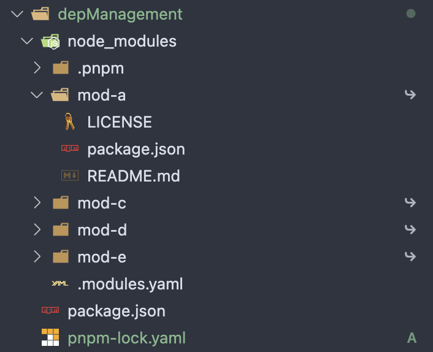

### 前言

前端开发者们每天都在接触 `xxx install`，包管理器是必不可少的工具，在项目开发的过程中难免会引用到各种不同的库，而这些库又依赖其他不同的库，这些依赖应该如何进行管理？

### npm

npm 可以说是最早的依赖安装脚手架，于 2010 年发布，是 nodejs 内置的包管理工具。`npm install` 命令执行的简要过程：

1. 发出 `npm install` 命令。
2. 读取配置相关文件。
3. 确定依赖版本，构建依赖树。
4. 检查缓存。
5. 下载压缩包，存放在 `~/.npm` 或者 `%LocalAppData%\npm-cache` 目录。
6. 将压缩包解压到当前项目的 `node_modules` 目录。

版本不同，在依赖管理上亦有所区别，下面分别进行说明。

#### npm v1/v2

npm 最早的版本是通过简明直观的嵌套模式来进行依赖管理的。比如说项目依赖了 mod-a 和 mod-e，而 mod-a 和 mod-e 又依赖了 mod-b 模块，那么此时项目的 node_modules 目录结构将如下所示：

```shell
node_modules
├── mod-a@1.0.0
│   └── node_modules
│       └── mod-b@1.0.0
└── mod-e@1.0.0
    └── node_modules
        └── mod-b@1.0.0
```

这种模式虽然简明直观，一眼看上去就能知道各个模块的依赖构成，但是它也带来了一个严重的问题：**嵌套地狱**。

##### 嵌套地狱

从前面的结构中不难看到，mod-b 被安装了两次。而随着项目规模的扩大，势必会在项目的直接依赖中出现不少重复的子依赖，这会导致存储空间极大的浪费。除此之外，子依赖也会有自己的依赖，这样层层嵌套下去，最后项目的 node_modules 目录结构将会难以避免地变成层次非常深的嵌套地狱。


#### npm v3

npm v3 重写了依赖管理，它通过扁平化的方式将子依赖直接提升到项目的 node_modules 目录下(hoisting)，以减少嵌套模式所带来的深层依赖和依赖冗余。以前面的例子来说，在 npm v3 版本下，node_modules 目录结构将变成下面这样：

```shell
node_modules
├── mod-a@1.0.0
├── mod-b@1.0.0
├── mod-e@1.0.0
```

可以看到作为子依赖的 mod-b@1.0.0 没有再放在项目直接依赖 mod-a 和 mod-e 的 node_modules 目录下，而是直接平铺在了项目的 node_modules 下，和直接依赖同级。

> Tips: 字典序(即字母顺序)排在前面的 npm 包的底层依赖会被优先提出来。

##### 幽灵依赖

扁平化模式解决了嵌套地狱，但是依赖提升的这个机制同样也带来了新的问题。子依赖被提升之后，项目源码可以直接引用这些没有在 package.json 文件中声明的依赖，并且由于确实可以找到依赖所以项目打包阶段不会出现任何问题。但是，这依旧是个隐藏的风险，下面举例进行详细说明。

###### 示例

假设项目直接依赖于 `npm-packageA`，`npm-packageA` 则依赖于 `npm-packageE`，项目源码如下：

```javscript
import someMethod from 'npm-packageE';

someMethod();
```

场景一：某天，`npm-packageA` 版本升级，它不再依赖 `npm-packageE`。此时，上面代码很明显会因为找不到 `npm-packageE` 而出错。不过这种情况还好，项目打包的时候会报错找不到依赖，所以也不会影响到线上。

场景二：某天，`npm-packageA` 版本升级，它依赖的 `npm-packageE` 也跟着升级了。升级后的 `npm-packageE` 还是导出了 `someMethod`，但是 `someMethod` 不再是一个函数，它的用法变成了 `someMethod.run()`。此时，项目在打包阶段不会因为找不到依赖而报错中断，但是一旦上线，只要用户的操作触发了这段代码执行，那必定会导致线上报错。

解决方法：可以开启 `eslint-plugin-import` 这个 eslint 插件的 `import/no-extraneous-dependencies` 规则。

##### 多重依赖

扁平化解决了嵌套模式所带来的深层依赖，但是并没有完全解决依赖冗余。假设项目存在如下依赖关系：

- mod-a、mod-c、mod-d、mod-e 是项目的直接依赖模块
- mod-a 和 mod-e 依赖 mod-b@1.0.0
- mod-c 和 mod-d 依赖 mod-b@2.0.0

提升 mod-b@1.0.0 之后，此时项目的 node_modules 目录结构将如下所示：

```shell
node_modules
├── mod-a@1.0.0
├── mod-b@1.0.0
├── mod-c@1.0.0
│    └── node_modules
│         └── B@2.0.0
├── mod-d@1.0.0
│    └── node_modules
│         └── B@2.0.0
├── mod-e@1.0.0
```


可以看到 mod-b@2.0.0 会被安装两次，而实际上不管是提升 mod-b@1.0.0 还是提升 mod-b@2.0.0，都会多安装一份。此外，虽然功能代码是独立的不会相互污染，但是它们的 types 定义却是可以相互影响的，版本重复可能会导致全局的 types 命名冲突。

##### 不确定性

在前端包管理的背景下，确定性指的是在给定的 package.json 文件下，无论在何种环境下执行 npm install 命令都能得到相同的 node_modules 目录结构。然而 npm v3 并不能实现这一点，它生成的 node_modules 目录和依赖树结构会收到用户安装顺序的影响。

这里继续以**多重依赖**的例子进行说明：

最开始时，项目依赖树结构如下所示：

```shell
node_modules
├── mod-a@1.0.0
├── mod-b@1.0.0
├── mod-c@1.0.0
│    └── node_modules
│         └── B@2.0.0
├── mod-d@1.0.0
│    └── node_modules
│         └── B@2.0.0
├── mod-e@1.0.0
```

然后，开发人员使用 npm 手动将 mod-a 升级到 2.0.0 版本，而 mod-a@2.0.0 依赖的 mod-b 也从 1.0.0 变成了 2.0.0。那么此时，项目的依赖树结构将变成：

```shell
node_modules
├── mod-a@1.0.0
│    └── node_modules
│         └── mod-b@2.0.0
├── mod-b@1.0.0
├── mod-c@1.0.0
│    └── node_modules
│         └── mod-b@2.0.0
├── mod-d@1.0.0
│    └── node_modules
│         └── mod-b@2.0.0
├── mod-e@1.0.0
```

接着，本地开发完成，准备将项目部署到服务器。在部署流水线中，npm install 执行，此时提升的子依赖发生了变化，从原来的 mod-b@1.0.0 变成了 mod-b@2.0.0：

```shell
node_modules
├── mod-a@2.0.0
├── mod-b@2.0.0
├── mod-c@1.0.0
├── mod-d@1.0.0
├── mod-e@1.0.0
│    └── node_modules
│         └── mod-b@1.0.0
```

也就是说，本地开发的时候和部署线上时，虽然用的都是同样内容的 package.json 文件，但是却产生了不同的 node_modules 结构，这有可能会导致线上环境出现一些意料之外的问题。如果需要结构一致，那就只能在修改 package.json 的时候，删除 node_modules 再重新 npm install。

#### npm v5

npm v5 新增了 package-lock.json 文件。当项目存在 package.json 文件并首次执行 npm install 时，npm 会自动生成一个 package-lock.json 文件。该文件的作用正如文件名中的 lock 一样，它会记录项目直接依赖的模块以及它们的子依赖，并给每个依赖都标明具体版本、获取地址和验证模块完整性的哈希值等等。通过 package-lock.json 文件，可以保障依赖安装的确定性和兼容性，使得每次安装都能得到相同的结果。

##### 一致性

考虑上文案例，初始时安装生成 package-lock.json 如下面左图所示。当执行 `npm install mod-a@2 --save` 之后，新的 package-lock.json 如右图所示。

> Tips: dependencies 对象中列出的依赖都是提升的依赖，每个依赖项中的 requires 对象中为子依赖项。
> PS. 测试使用的 npm version 是 6.14.8，node version 是 v20.16.0


可以看到版本升级前后，dependencies 对象的键并没有发生变化，只是 mod-a 的记录信息有所有变化，也就是说重新生成的 node_modules 目录结构不会发生变化(升级版本之后，将整个 node_modules 删除，执行 npm install，新生成的 node_modules 结构确实和之前的一样)。

##### 兼容性

说到兼容性，那就不得不提一下 npm 使用的 SemVer 版本规范，版本格式如下：

1. 主版本号：当进行不兼容的 API 更改时，增加主版本号。
2. 次版本号：当进行向下兼容的功能添加时，增加次版本号。
3. 修订号：当进行向下兼容的错误修复时，增加修订号。


在使用第三方依赖时，通常会在 package.json 中指定依赖的版本范围，语义化版本范围规定如下：

1. ~：只升级修订号
2. ^：升级次版本号和修订号
3. \*：升级到最新版本

语义化版本规则定义了一种理想的版本号更新规则，希望所有的依赖更新都能遵循这个规则，但是往往会有许多依赖不是严格遵循这些规定来进行更新的。因此，一些依赖模块子依赖不经意的升级，可能就会导致不兼容的问题发生，这也是为什么 package-lock.json 会给每个模块表明具体的版本号。

### yarn

Yarn 是由 Facebook 在 2016 年推出的包管理器，旨在解决 npm v3 存在的一些问题(这个时候 npm v5 还没发布)。

#### yarn v1

Yarn 生成的 node_modules 目录结构和后面发布的 npm v5 是一样的，此外也会生成一个 lock 文件：yarn.lock。前面的例子使用 yarn 来安装依赖的话，生成的 yarn.lock 文件如下所示：

```
# THIS IS AN AUTOGENERATED FILE. DO NOT EDIT THIS FILE DIRECTLY.
# yarn lockfile v1


mod-a@^1.0.0:
  version "1.0.0"
  resolved "https://npm.shopee.io/mod-a/-/mod-a-1.0.0.tgz#d27217e16777d7c0c14b2d49e365119de3bf4da0"
  integrity sha512-LHSY3BAvHk8CV3O2J2zraDq10+VI1QT1yCTildRW12JSWwFvsnzwLhdOdrJG2gaHHIya7N4GndK+ZFh1bTBjFw==
  dependencies:
    mod-b "^1.0.0"

mod-b@^1.0.0:
  version "1.0.0"
  resolved "https://npm.shopee.io/mod-b/-/mod-b-1.0.0.tgz#0d6e560f07d533708a39693b5de7188db74b66b8"
  integrity sha512-w3+jMEBzh6ap32RoJkmkFSIi6EmBYArDviaA9mAri/zfhu5pKcIFhyiGdtt9Ce9Wz6aF7wkkL9hMd3F4XWgjsA==

mod-b@^2.0.0:
  version "2.0.0"
  resolved "https://npm.shopee.io/mod-b/-/mod-b-2.0.0.tgz#d3c10b5815b31689a51b7c7d84341825353a2382"
  integrity sha512-F1mbrVGqDeid+VoEdswLYsznXnTG/k8xf5aYRTX7ifhzWk9yzwQJPq5wHikqx+/eLzwEaj9tjVQSLO2prdRZew==

mod-c@^1.0.0:
  version "1.0.0"
  resolved "https://npm.shopee.io/mod-c/-/mod-c-1.0.0.tgz#849adb050fcb7f5dd463b105dbf23771a3bd9df0"
  integrity sha512-aUhu8lL4T+UYGNi9qd+DqBfCuDaZxkBJ0gDC5lS9WhQmLusTncROjXL0W8JvVe3mvwrbJCTTbyJ8SJpm1pd9Og==
  dependencies:
    mod-b "^2.0.0"

mod-d@^1.0.0:
  version "1.0.0"
  resolved "https://npm.shopee.io/mod-d/-/mod-d-1.0.0.tgz#54d9ed3bd9c529622bdc1874001128e8889146e8"
  integrity sha512-7gg7sLWjR7X0orcoF6YNl34FWZiR+RzeeuJgBxd7k2FfuuPZvwPGKu8/LShEMeGmSFT/s0Mg7SpztSq1P+IK1w==
  dependencies:
    mod-b "^2.0.0"

mod-e@^1.0.0:
  version "1.0.0"
  resolved "https://npm.shopee.io/mod-e/-/mod-e-1.0.0.tgz#5e844c9a5309220f0c21107b9374145bc5af3944"
  integrity sha512-R6Bkcffy5MNjNJlXYd8pmb0y5izO0GOZH4SmCdf7le/jQMzdGAO6/zswP8dZv3kunkCc/eOnxPKLw0MWe94alQ==
  dependencies:
    mod-b "^1.0.0"
```

不难发现，yarn lock 文件使用了自定义格式而像 npm lock 文件那样使用 JSON 格式，并且为了更加便于阅读、审查以及减少代码合并冲突，它还将所有依赖都放在了顶层。此外，两者还有一个明显的不同之处在于，npm lock 文件里记录的依赖版本是具体且明确的，不会出现语义化版本范围符号(~^\*)，而 yarn lock 文件里会出现这些符号。

#### yarn v2

node 依赖 node_modules 查找依赖，而 node_modules 的生成涉及到依赖包下载、解压到缓存、拷贝到项目文件目录等一系列重 IO 的操作，包括依赖查找、处理重复依赖等等都是非常耗时的操作，基于 node_modules 的包管理器没有多少优化的空间。因此，yarn 反其道而行之，在 2.x 版本重点推出了 Plug'n'Play(PnP) 零安装模式，直接放弃了 node_modules。yarn 认为既然包管理器已经有了项目依赖树的结构，那么可以直接由包管理器通知解释器依赖包在磁盘上的位置并管理依赖包和子依赖的关系。

执行 `yarn --pnp` 即可开启 PnP 模式，在 PnP 模式下，yarn 会生成 .pnp.cjs 文件来替代 node_modules。这个文件维护了依赖包和磁盘位置以及子依赖项列表的映射。此外，.pnp.js 还实现了 resolveRequest 方法用于处理 require 请求，该方法会直接根据映射表确定依赖在文件系统中的位置，从而避免了在 node_modules 中查找依赖的 IO 操作。


PnP 模式的优缺点：

- 优点：拜托了 node_modules，安装和加载模块的速度快；所有 npm 模块都会放在全局的缓存目录下，避免了多重依赖；严格模式下依赖不会提升，所以也避免了幽灵依赖。
- 缺点：自实现了一套 resolver 来处理 node 的 require 方法，执行 node 文件需要通过 yarn node 解释器来执行，脱离了 node 生态，兼容性不好。

### pnpm

pnpm 全称 "Performant NPM"，即高性能的 npm，是由 Zoltan Kochan 在 2017 年 6 月发布的新一代包管理器，它的出现进一步解决了 npm 和 yarn 存在的问题。

#### 优势

pnpm 具有安装速度快、节省磁盘空间、安全性高三大优势。下面是官网关于 pnpm 依赖管理机制的说明图，诠释了三大优势的原理：


- 所有依赖包都安装在全局目录 `~/.pnpm-store/v3/files` 下，同一个版本的依赖包只存储一份，甚至不同版本的依赖包也只是存储 diff 内容。
- 所有项目的 node_modules 都有个 .pnpm 目录以 `package@version` 的命名方式和完全打平的结构管理着项目的所有依赖(包括子依赖)的源码。
- 每个 `package@version` 下则存有 `package` 指向 .pnpm-store 内真实内容地址的硬链接。而由于 `package` 本身也可能有依赖，为契合 node 查找依赖的规则(寻找最近的 node_modules)，也为了方便查看依赖，`package` 的硬链接和它的依赖是同级目录的形式放在 `package@version/node_modules` 下。
- 所有项目的 node_modules 的一级子目录下都只有直接依赖包，和项目的 package.json 文件完全对应，不存在任何子依赖被提升。不过需要注意的是，这些直接依赖包并不是真实文件，而是指向 .pnpm 下依赖包的软链接。

也就是说，每个依赖包的查找需要经过三层结构：`node_modules/package` -> `node_modules/.pnpm/package@version/node_modules/package` -> `~/.pnpm-store/v3/files/xxx`

#### 示例

这里继续使用前面的例子，来逐步分析下执行 `pnpm install` 之后，项目的 node_modules 目录结构以及项目查找依赖的过程。



从上面的图中可以看到：

1. node_modules 目录下确实只有项目的直接依赖。
2. 项目的直接依赖之一，mod-a 文件夹下面没有 node_modules。这很奇怪，毕竟 mod-a 依赖于 mod-b@1.0.0，没有 node_modules，mod-a 怎么找到依赖呢？

之所以没出问题，是因为此处 mod-a 并不是真实的源文件，而是个软链接。文件夹右侧的箭头直观地表明了它的身份，我们也可以通过 `readlink` 命令来识别出这一点：

```shell
readlink mod-a

.pnpm/mod-a@1.0.0/node_modules/mod-a
```

从命令结果可以看到，mod-a 链接的真实文件地址是在 .pnpm 文件夹下，展开 .pnpm 之后，果然发现了 mod-a，并且 mod-a 的依赖 mod-b 也在这儿：


从图中可以看到项目的所有依赖(不管是直接依赖还是子依赖)确实都以 `<package>@version` 的格式直接平铺在了 .pnpm 里面。而且，将依赖本体和其子依赖放在同一个 node_modules 目录下，不仅完美地兼容了原生 node 的依赖查找方式，还非常直观地展示出了子依赖。

#### 不足

pnpm 同样也存在不足，比如：

1. 全局 hardlink 虽然节省磁盘空间，但也会导致修改一处影响所有项目。
2. 对 postinstall 的支持不友好。
3. 在不支持软链接的环境中(e.g. Electron)，无法使用。

### 参考资料

[聊聊依赖管理](https://mp.weixin.qq.com/s/9JCs3rCmVuGT3FvKxXMJwg)
[前端包管理器的依赖管理原理](https://developer.aliyun.com/article/883281)
[npm 工作机制](https://bramble-river.gitbooks.io/npm/content/methods.html)
[关于现代包管理器的深度思考——为什么现在我更推荐 pnpm 而不是 npm/yarn?](https://juejin.cn/post/6932046455733485575)
[pnpm 讲解](https://www.cnblogs.com/kitebear/p/17392708.html)
