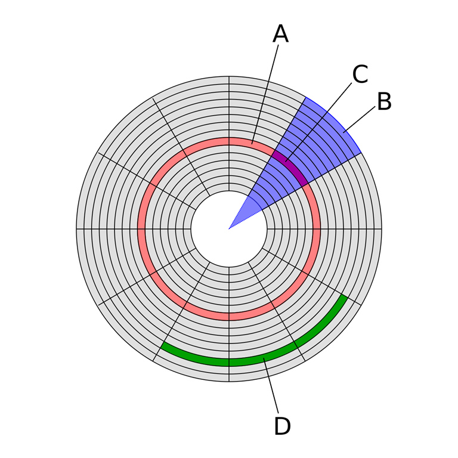
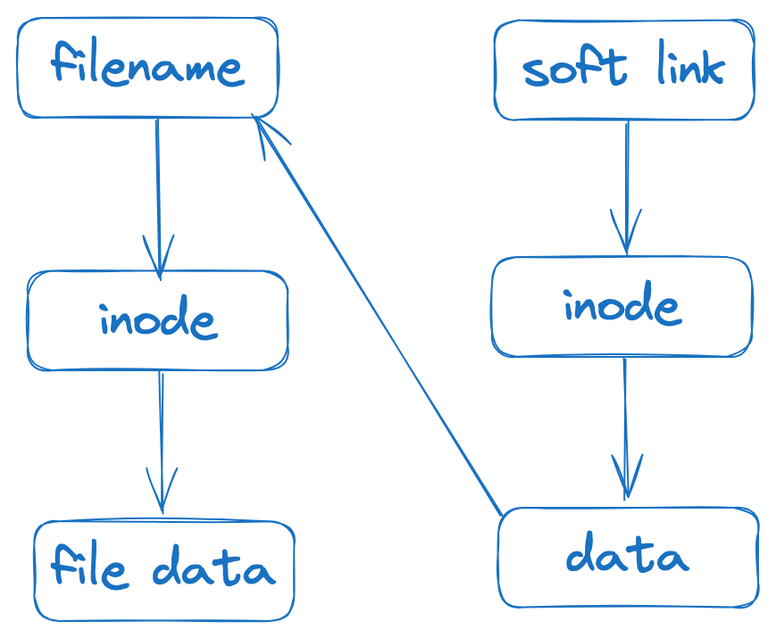
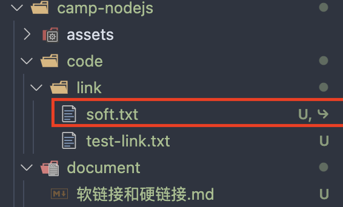
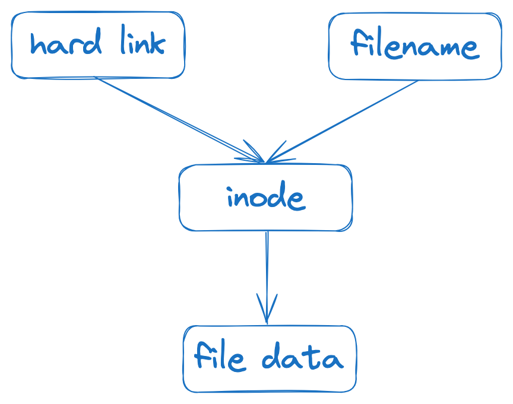
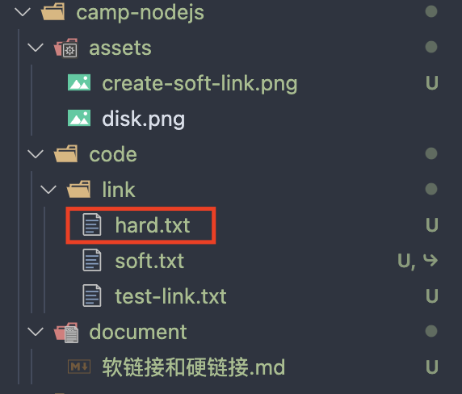

### 磁道、扇区

在计算机磁盘存储中，有多个同心圆刻画在磁盘表面，磁道指的就是这些用于存储数据的环形轨道，扇区则是磁道的细分。扇区是磁盘的最小存储单元，通常是 512 字节或者 4 KB。每个扇区都有着唯一地址，可以通过这个地址来读写扇区内的数据。而由于扇区的空间比较小，当文件稍微大点时，数量众多的扇区会造成高昂的寻址成本，于是操作系统就将相邻的扇区组合在一起，形成一个块(linux)/簇(windows)，再对块/蔟进行整体操作，以此提升读写效率。因此，块/蔟是操作系统中最小的逻辑存储单元。

下面这个是维基百科上的图片，形象地介绍了磁道、扇区等概念：

A：磁盘磁道（红色区域）
B：几何学中的扇形（蓝紫色区域）
C：磁盘扇区（玫红色区域）
D：块/蔟（绿色区域）



### 索引节点

当文件被创建时，文件系统会为该文件分配一个唯一的索引节点（Index Node，简称 inode）用于存储文件的元数据，它上与文件名关联，下与存储文件内容的块/簇相关联，通常包含以下信息：

- 文件类型：指示文件是普通文件、目录、符号链接等。
- 文件权限：指定了对文件的访问权限。
- 文件所有者和所属组：表示文件的所有者和所属组。
- 文件大小：文件的大小（以字节为单位）。
- 时间戳：记录了文件的创建时间、修改时间和访问时间。
- 链接计数：指示有多少个目录项指向该索引节点。
- 数据块指针：指向存储文件数据的实际数据块。

通过 `linux` 指令 `stat` 可以查看文件的索引节点信息：

```shell
stat test-link.text

16777222 171645962 -rw-r--r-- 1 orient-i staff 0 43 "Aug  1 10:12:08 2024" "Aug  1 10:12:06 2024" "Aug  1 10:12:06 2024" "Aug  1 10:12:06 2024" 4096 8 0 test-link.txt
```

> Tips: nodejs 可以通过 fs.statSync 获取文件的索引节点信息。

### 软链接

定义：软链接（符号链接）是一个指向其他文件或目录的特殊文件，创建软链接就是在创建一个新的文件，类似于 Windows 系统中的快捷方式。它有如下特点：

- 本身是个文件，包含了所指向的目标文件或目录的路径信息。
- 可以指向任何文件或目录，即使目标文件或目录不存在(此时访问软链接会提示 "No such file or directory")。
- 删除软链接不会影响目标文件或目录。
- 可以通过相对路径或者绝对路径来指向目标。

图解：



下面通过实际操作来体验下软链接：

1. `ln -s source target` 创建软链接。

```shell
ln -s test-link.txt soft.txt
```

命令执行完成后，可以在目录中看到软链接创建成功：


2. `ls -li` 查看所有文件的详细信息。

> Tips: ls 列出文件和目录，-l 是个选项，表示以长格式显示文件和目录的详细信息，-i 也是个选项，表示显示文件和目录的 inode 号码。

```shell
ls -li

171646790 lrwxr-xr-x  1 orient-i  staff  13 Aug  1 10:28 soft.txt -> test-link.txt
171645962 -rw-r--r--  1 orient-i  staff  43 Aug  1 10:12 test-link.txt
```

从最左侧的结果中不难发现，软链接的 `inode` 和原始文件的 `inode` 是不一样的，这也表明了软链接是个全新的文件。

3. `readlink` 命令查看软链接指向的目标文件或目录。

```shell
readlink soft.txt

test-link.txt
```

4. 删除原始文件，再次访问软链接。

```shell
rm test-link.txt %% cat soft.txt

cat: soft.txt: No such file or directory
```

### 硬链接

定义：硬链接可以理解为一个指向目标文件内容的文件别名，创建硬链接只是在系统内给目标文件的内容取了一个文件别名。它的特点如下：

- 是文件系统中的多个目录项(由文件名和文件的索引节点组成)，它们指向相同的物理文件。
- 只能链接文件，不能链接目录(如果尝试链接目录，会提示 "xxx: Is a directory")。
- 删除硬链接不会影响其他硬链接的访问和原始文件。
- 删除原始文件不影响硬链接的访问。

图解：



下面通过实际操作来体验下硬链接：

1. `ln source target` 创建硬链接。

```shell
ln test-link.txt hard.txt
```

命令执行完成后，可以在目录中看到软链接创建成功：


尝试链接目录：

```shell
ln link hard

ln: link: Is a directory
```

2. `ls -li` 查看所有文件的详细信息。

```shell
ls -li

171647919 -rw-r--r--  2 shopee  staff  42 Aug  1 10:49 hard.txt
171646790 lrwxr-xr-x  1 shopee  staff  13 Aug  1 10:28 soft.txt -> test-link.txt
171647919 -rw-r--r--  2 shopee  staff  42 Aug  1 10:49 test-link.txt
```

从最左侧的结果中，可以看到 `hard.txt` 和 `test-link.txt` 的 `inode` 号码是一样的。

3. 删除原始文件，再次访问硬链接。

```shell
rm test-link.txt && cat hard.txt

this is a test file for soft and hard link
```

可以看到，文件内容正常输出了。这是因为删除原始文件只是删除了一个目录项，硬链接还在。指向文件内容的那个 `inode` 还在，文件内容所占据的存储空间就还没有被操作系统给释放掉，因此文件内容还可以访问到。

### 应用

`npm link` 的原理正式通过软链接实现的。

1. 创建共享代码的文件夹 `a` 和使用共享代码的文件夹 `b`。
2. 在两个文件夹下都执行 `npm init -y` 命令，初始化文件夹。
3. 在两个文件夹下的 `package.json` 文件里添加 `"type": "module"`。
4. 文件夹 `a` 下新建 `index.js` 文件，并添加以下内容：

```javascript
function log() {
  console.log("I am a function from a folder!");
}

export default log;
```

5. 文件夹 `b` 下新建 `index.js` 文件，并添加以下内容：

```javascript
import log from "a";
log();
```

6. 文件夹 `a` 下执行 `npm link`。这将会在全局的 `node_modules` 中创建一个软链接，将项目 `a` 注册为全局可用的包。
7. 文件夹 `b` 下执行 `npm link <package-name>`。`<package-name>` 是指共享代码项目的 `package.json` 文件中定义的包名称，这里是 `a`。
8. 此时，执行项目 `b` 的 `index.js` 文件，可以看到终端如期打印 `I am a function from a folder!` 而不是报错找不到包 `a`。

> Tips: 删除 npm link，需要在共享代码项目和使用共享代码的项目里执行 npm unlink <package-name>。

### 参考资料

[存储基础知识：扇区与块/蔟](https://www.cnblogs.com/kerrycode/p/12701772.html)  
[前端开发者应该掌握的软连接和硬链接知识](https://juejin.cn/post/7147922973612048398?searchId=20240712153512A111306524A5B73FE06B)
[硬链接和软链接](https://www.cnblogs.com/diantong/p/10507132.html)
