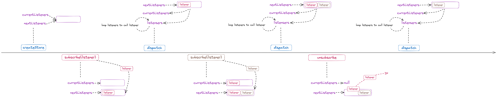

### 前言

`redux` 自 5.0.0 版本开始，实现方案从 `js` 改成了 `ts`，源码中多出了很多类型定义。但相比 4.2.1，功能变化不大，为了更方便地阅读和理解代码，此次源码阅读依赖的版本是 4.2.1。

### 目录

下面是项目的 src 目录结构：

```
src
  ├── applyMiddleware.js
  ├── bindActionCreators.js
  ├── combineReducers.js
  ├── compose.js
  ├── createStore.js
  ├── index.js
  └── utils
      ├── actionTypes.js
      ├── formatProdErrorMessage.js
      ├── isPlainObject.js
      ├── kindOf.js
      ├── symbol-observable.js
      └── warning.js
```

可以看到，`redux` 的项目文件还是蛮少的。

#### utils

避免后续分析核心代码中断，先从通用工具方法文件夹 `utils` 开始分析

##### actionTypes.js

`actionTypes.js` 文件用于定义一些 `redux` 内部使用的 `action` 类型，`randomString` 函数用于生成随机字符串，防止这些内部使用的 `action` 类型和开发者定义的 `action` 类型发生冲突。

```javascript
const randomString = () =>
  Math.random().toString(36).substring(7).split("").join(".");

const ActionTypes = {
  INIT: `@@redux/INIT${randomString()}`,
  REPLACE: `@@redux/REPLACE${randomString()}`,
  PROBE_UNKNOWN_ACTION: () => `@@redux/PROBE_UNKNOWN_ACTION${randomString()}`,
};

export default ActionTypes;
```

##### formatProdErrorMessage

`formatProdErrorMessage.js` 文件用于格式化在生产环节中捕获到的错误消息。

```javascript
function formatProdErrorMessage(code) {
  return (
    `Minified Redux error #${code}; visit https://redux.js.org/Errors?code=${code} for the full message or ` +
    "use the non-minified dev environment for full errors. "
  );
}

export default formatProdErrorMessage;
```

##### isPlainObject

`isPlainObject.js` 文件的作用就像它的文件名一样，它用于判定参数是否是一个“纯对象”。

```javascript
export default function isPlainObject(obj) {
  if (typeof obj !== "object" || obj === null) return false;

  let proto = obj;
  while (Object.getPrototypeOf(proto) !== null) {
    proto = Object.getPrototypeOf(proto);
  }

  return Object.getPrototypeOf(obj) === proto;
}
```

“纯对象”指的是直接继承自 `Object.prototype` 的对象（或者原型为 `null` 的对象），可以通过字面量声明、`new Object()`、`Object.create(null)` 这三种方式创建纯对象。

> 注意，4.2.1 的 isPlainObject 不会将 Object.create(null) 创建的对象视作纯对象。这个问题在 5.0.1 被修复了，详情请看 https://github.com/reduxjs/redux/pull/4633

##### kindOf

`kindOf.js` 文件用于获取参数的类型。在非生产模式下，参数类型会划分的更细一些，比如 `Promise`，`WeakMap`，`WeakSet`，`Error` 等等。

##### symbol-observable

`symbol-observale.js` 文件是对 `Symbol.observable` 的 `polyfill`。

```javascript
export default (() =>
  (typeof Symbol === "function" && Symbol.observable) || "@@observable")();
```

##### warning

`warning.js` 文件会先将错误的详细信息打印出来，然后再将错误抛出。

```javascript
export default function warning(message) {
  if (typeof console !== "undefined" && typeof console.error === "function") {
    console.error(message);
  }
  try {
    throw new Error(message);
  } catch (e) {}
}
```

#### core

接下来逐个分析核心文件代码。

##### index

`index.js` 文件是个纯导出文件，用于将其他文件的内容向外导出。

```javascript
import { createStore, legacy_createStore } from "./createStore";
import combineReducers from "./combineReducers";
import bindActionCreators from "./bindActionCreators";
import applyMiddleware from "./applyMiddleware";
import compose from "./compose";
import __DO_NOT_USE__ActionTypes from "./utils/actionTypes";

export {
  createStore,
  legacy_createStore,
  combineReducers,
  bindActionCreators,
  applyMiddleware,
  compose,
  __DO_NOT_USE__ActionTypes,
};
```

##### compose

`compose.js` 文件用于实现函数组合。

```javascript
// (...args) => f(g(h(...args))) === compose(f, g, h)(...args)

export default function compose(...funcs) {
  if (funcs.length === 0) {
    return (arg) => arg;
  }

  if (funcs.length === 1) {
    return funcs[0];
  }

  // prettier-ignore
  return funcs.reduce((a, b) => (...args) => a(b(...args)));
}
```

##### bindActionCreators

`action creator` 是指返回值为 `action` 的函数，例如：

```javascript
function add(payload) {
  return { type: "add", payload };
}

class ComponentA extends React.Component {
  handleClick() {
    const { add } = this.props;
  }

  render() {
    return <div onClick={handleClick}>increment</div>;
  }
}

const mapDIspatchToProps = (dispatch) => ({
  add: () => dispatch(add);
});

// prettier ignore
export default connect(undefined, mapDispatchToProps, undefined, undefined)(ComponentA);
```

`bindActionCreators` 会将 `dispatch` 和 `action creator` 给 `bind` (绑定)起来，自动执行 `dispatch` 操作，不再需要开发者手动执行 `dispatch` 操作。

```javascript
function bindActionCreator(actionCreator, dispatch) {
  return function () {
    return dispatch(actionCreator.apply(this, arguments));
  };
}

export default function bindActionCreators(actionCreators, dispatch) {
  if (typeof actionCreators === "function") {
    return bindActionCreator(actionCreators, dispatch);
  }

  if (typeof actionCreators !== "object" || actionCreators === null) {
    throw new Error(
      `bindActionCreators expected an object or a function, but instead received: '${kindOf(
        actionCreators
      )}'. ` +
        `Did you write "import ActionCreators from" instead of "import * as ActionCreators from"?`
    );
  }

  const boundActionCreators = {};
  for (const key in actionCreators) {
    const actionCreator = actionCreators[key];
    if (typeof actionCreator === "function") {
      boundActionCreators[key] = bindActionCreator(actionCreator, dispatch);
    }
  }
  return boundActionCreators;
}
```

在类组件场景下，使用 `connect` 将 `action creator` 绑定到组件上时，可以将 `mapDispatchToProps` 的值设置成一个简写对象，`react-redux` 会自动执行 `bindActionCreators` 将 `dispatch` 注入到 `action creator` 中。详情请看：[官方文档说明](https://cn.react-redux.js.org/api/connect/#%E5%AF%B9%E8%B1%A1%E7%AE%80%E5%86%99%E5%BD%A2%E5%BC%8F)。

##### combineReducers

`reducer` 是一个纯函数，它接受之前的 `state` 和一个 `action`，并返回一个新的 `state`。而 `redux` 之所以把它被叫做 `reducer`，是因为它和传入 `Array.prototype.reduce` 里的回调函数的类型一样。

`reducers` 是一个 `value` 是 `reducer` 的对象，`combineReducers` 文件会将 `reducers` 里的所有 `reducer` 合并成一个 `reducer`。

```javascript
export default function combineReducers(reducers) {
  const reducerKeys = Object.keys(reducers);
  const finalReducers = {};
  // 检查 reducers 的 value 是否合法，如果合法，则添加到 finalReducers 中
  for (let i = 0; i < reducerKeys.length; i++) {
    const key = reducerKeys[i];

    // value 不能是 undefined
    if (process.env.NODE_ENV !== "production") {
      if (typeof reducers[key] === "undefined") {
        warning(`No reducer provided for key "${key}"`);
      }
    }

    // 判定 reducer 是否是一个函数
    if (typeof reducers[key] === "function") {
      finalReducers[key] = reducers[key];
    }
  }
  const finalReducerKeys = Object.keys(finalReducers);

  // This is used to make sure we don't warn about the same
  // keys multiple times.
  let unexpectedKeyCache;
  if (process.env.NODE_ENV !== "production") {
    unexpectedKeyCache = {};
  }

  let shapeAssertionError;
  try {
    // 使用内置的 INIT 和 PROBE_UNKNOWN_ACTION 类型触发所有 reducer，以判断 reducer 在无法识别 action 时是否有默认处理。
    // 判断默认处理的返回值是否为 undefined。如果是，则该 reducer 非法。
    assertReducerShape(finalReducers);
  } catch (e) {
    shapeAssertionError = e;
  }

  // combineReducers 最终返回的是一个叫 combination 的函数，这个函数就是最终合并的 reducer
  return function combination(state = {}, action) {
    if (shapeAssertionError) {
      // 如果前面找到了非法的 reducer，直接抛出异常，终止流程
      throw shapeAssertionError;
    }

    // 这里调用同文件里的 getUnexpectedStateShapeWarningMessage 函数对参数做了多重校验：
    // 1. 判断 finalReducers 是否有效。如果是个空对象，没有任何 key-value，报错。
    // 2. 判断 state 是否是一个纯对象。如果不是，报错。
    // 3. 判断 state 的 key 是否都存在于 finalReducers 中。如果没有，报错。

    // other code ...

    let hasChanged = false;
    const nextState = {};
    // 遍历执行所有的 reducer
    // action 只是给其中某一个 reducer 的，这也是为什么所有 reducer 的 switch...case 中都要保留一个 default 的处理逻辑
    for (let i = 0; i < finalReducerKeys.length; i++) {
      const key = finalReducerKeys[i];
      const reducer = finalReducers[key];
      const previousStateForKey = state[key];
      const nextStateForKey = reducer(previousStateForKey, action);
      // 执行开发者自定义的 action，如果 reducer 返回了 undefined，报错。
      if (typeof nextStateForKey === "undefined") {
        const actionType = action && action.type;
        throw new Error(
          `When called with an action of type ${
            actionType ? `"${String(actionType)}"` : "(unknown type)"
          }, the slice reducer for key "${key}" returned undefined. ` +
            `To ignore an action, you must explicitly return the previous state. ` +
            `If you want this reducer to hold no value, you can return null instead of undefined.`
        );
      }
      nextState[key] = nextStateForKey;
      // 对比执行 action 前后的值，判断 state 是否发生变化
      hasChanged = hasChanged || nextStateForKey !== previousStateForKey;
    }
    hasChanged =
      hasChanged || finalReducerKeys.length !== Object.keys(state).length;
    return hasChanged ? nextState : state;
  };
}
```

##### createStore

`store` 是一个用来维持应用整个 `state` 的对象，它拥有四个方法：

1. `getState()`
2. `dispatch(action)`
3. `subscribe(listener)`
4. `replaceReducer(nextReducer)`

其中的第二点是改变 `store` 内 `state` 的唯一途径。`createStore` 就是用于创建一个这样的 `store` 对象，下面逐步对它进行分析。

```javascript
export function createStore(reducer, preloadedState, enhancer) {
  // 判断参数是否符合要求
  // other code ...

  if (typeof preloadedState === "function" && typeof enhancer === "undefined") {
    enhancer = preloadedState;
    preloadedState = undefined;
  }

  // enhancer 是一个可以增强 store 功能的函数，触发 enhancer 流程时，提前返回，由 enhancer 接手 store 的创建
  if (typeof enhancer !== "undefined") {
    // 校验 enhancer 是否是 function，若不是，报错，流程终止
    // other code ...

    return enhancer(createStore)(reducer, preloadedState);
  }

  let currentReducer = reducer;
  let currentState = preloadedState;
  let currentListeners = [];
  let nextListeners = currentListeners;
  // reducer 是否正在执行
  let isDispatching = false;

  // 后面关于 dispatch 的分析中会提到
  function ensureCanMutateNextListeners() {
    // other code ...
  }

  // store 的第一个功能，获取 store 内维护的 state
  function getState() {
    if (isDispatching) {
      throw new Error("xxx");
    }
    return currentState;
  }

  // store 的第三个功能，监听 state 的变化
  // 通过 subscribe 传入的 listener 会在 state 发生变更时触发执行
  // 返回值是个函数，可以通过执行返回值取消监听
  function subscribe(listener) {
    // other code ...
  }

  // store 的第二个功能，触发 reducer 执行以更新 state，返回值是 action 本身
  function dispatch(action) {
    // other code ...
  }

  // store 的第四个功能，替换当前 store 用来计算 state 的 reducer，一般来说用不着
  function replaceReducer(nextReducer) {
    // other code ...
  }

  // 隐藏功能，将 store 转换成一个可观察对象，可以搭配 RxJs 使用
  function observable() {
    // other code ...
  }

  // 触发第一个更新，初始化 state
  dispatch({ type: ActionTypes.INIT });

  return {
    dispatch,
    subscribe,
    getState,
    replaceReducer,
    [$$observable]: observable,
  };
}
```

从源码中可以看到，`createStore` 有两条分支走向：

```javascript
// 1
dispatch({ type: ActionTypes.INIT });

// 2，后面在 applyMiddleware 的分析时会说到
return enhancer(createStore)(reducer, preloadedState);
```

第二条分支走向后面在 `applyMiddleware` 的分析时再说，这里先分析下第一条分支走向，看看 `dispatch` 做了些什么。

```javascript
function dispatch(action) {
  // 校验 action：是否为纯对象、action.type 是否存在
  // other code ...

  // 为什么要有这样一个 isDispatching 变量？这全都是同步操作啊
  // 答案：为了避免在 reducer 中调用 dispatch，详情请看 https://github.com/reduxjs/redux/issues/1668
  if (isDispatching) {
    throw new Error("Reducers may not dispatch actions.");
  }

  try {
    isDispatching = true;
    // 执行 reducer，计算新的 state
    // 如果使用 combineReducers，那么此处的 reducer 就是前面提到的 combination
    // currentState、action 这两个入参正好和形参 state、action 对应
    // currentState 对应 createStore 的入参 preloadedState，有可能是 undefined，这也和 combination 的 state = {} 对应上
    currentState = currentReducer(currentState, action);
  } finally {
    isDispatching = false;
  }

  // 在 state 更新完成后，逐个执行 state 监听函数
  const listeners = (currentListeners = nextListeners);
  for (let i = 0; i < listeners.length; i++) {
    const listener = listeners[i];
    listener();
  }

  // 返回 action 本身
  return action;
}
```

从源码分析中，可以发现 `dispatch` 流程就是先触发 `reducer` 的执行，然后在 `state` 更新之后，逐个执行监听 `state` 变化的回调函数。

回调函数的全流程：  


在上面回调函数的全流程图中，可以看到有两个相关变量和两个相关函数：`currentListeners`、`nextListeners`、`ensureCanMutateNextListeners`、`subscribe`。

- `currentListeners` 指的是在 `state` 变化后，等待执行的回调函数队列。
- `nextListeners` 指的是下一次 `state` 变化后，等待执行的回调函数队列。

之所以要弄两个队列，是为了避免在 `listener` 执行过程中，回调函数队列发生了变化，进而导致循环出现意料之外的错误。比如说：

```javascript
const callback1 = () => {
  console.log("xxx");
};

const callback2 = () => {
  console.log("###");
  unsubscribe1();
};

const callback3 = () => {
  console.log("***");
};

const unsubscribe1 = store.subscribe(callback1);
const unsubscribe2 = store.subscribe(callback2);
const unsubscribe3 = store.subscribe(callback3);

store.dispatch({ type: "xxx" });
```

如果只使用一个队列来存储回调函数，那么在上面这种场景下，`callback3` 会因为回调函数队列在执行 `callback2` 时长度被修改(-1)而导致无法触发。

结合上面的流程图和弊病分析之后，就不难理解 `ensureCanMutateNextListeners` 和 `subscribe` 的源码了。

```javascript
let currentListeners = [];
let nextListeners = currentListeners;

// 浅拷贝 currentListeners，避免在触发 listeners 的过程中出现意料之外的错误
function ensureCanMutateNextListeners() {
  if (nextListeners === currentListeners) {
    nextListeners = currentListeners.slice();
  }
}

function subscribe(listener) {
  // 判定 listener 是否是 function
  // other code ...

  if (isDispatching) {
    throw new Error("xxx");
  }
  let isSubscribed = true;
  ensureCanMutateNextListeners();
  nextListeners.push(listener);
  return function unsubscribe() {
    // 避免同一个 listener 多次执行 unsubscribe 出错
    if (!isSubscribed) {
      return;
    }
    if (isDispatching) {
      throw new Error("xxx");
    }
    isSubscribed = false;
    ensureCanMutateNextListeners();
    const index = nextListeners.indexOf(listener);
    // 将取消监听的回调函数从队列中移除
    nextListeners.splice(index, 1);
    currentListeners = null;
  };
}
```

##### applyMiddleware

`middleware` 是中间件，`apply` 是应用，`applyMiddleware` 意指通过将众多中间件串联起来形成一条 `middleware chain`（也就是一个 `enhancer`）来增强 `store` 的功能。


这种 `chain` 的思想非常契合前面的 `compose` 理念，`applyMiddleware` 源码内部也正是使用 `compose` 来构建 `middleware chain` 的。

下面是 `redux-thunk` 提供的 `middleware` 和一个自定义的 `middleware`：

```javascript
// 略作简化的 redux-thunk 源码
function thunk({ dispatch, getState }) {
  return (next) => (action) => {
    if (typeof action === "function") {
      return action(dispatch, getState, extraArgument);
    }
    return next(action);
  };
}

// 自定义 middleware
function logger({ dispatch, getState }) {
  return (next) => (action) => {
    console.log("will dispatch", action);
    const returnValue = next(action);
    console.log("state after dispatch", getState());
    return returnValue;
  };
}
```

下面按照如下方式来使用上述两个 `middleware`，以进一步分析 `middleware` 的执行过程：

```javascript
const store = createStore(rootReducer, applyMiddleware(logger, thunk));
store.dispatch({ type: "xxx" });
```

集合前面 `createStore` 的源码，不难看出上述用法会命中 `createStore` 的第二条分支走向，也就是说上面的代码等同于：

```javascript
const enhanceStore = applyMiddleware(logger, thunk)(createStore)(
  rootReducer,
  undefined
);
enhanceStore.dispatch({ type: "xxx" });
```

接下来结合 `applyMiddleware` 源码来逐步分析下执行过程：

```javascript
export default function applyMiddleware(...middlewares) {
  // 1. applyMiddleware(logger, thunk) 运行后，得到函数 (createStore) => (...args) => ...
  return (createStore) =>
    // 2. applyMiddleware(logger, thunk)(createStore) 运行后，得到函数 (...args) => ...
    (...args) => {
      // 3.1 创建原始 store 对象
      const store = createStore(...args);
      let dispatch = () => {
        throw new Error("xxx");
      };

      const middlewareAPI = {
        getState: store.getState,
        dispatch: (...args) => dispatch(...args),
      };
      // 3.2 遍历执行 middleware，拿到 middleware 的返回值
      // chain = [logger return value, thunk return value]
      // chain = [(next) => (action) => ... , (next) => (action) => ...]
      const chain = middlewares.map((middleware) => middleware(middlewareAPI));
      // 3.3 覆写 dispatch
      // dispatch = logger return value(thunk return value(store.dispatch))
      /* 
        const temp = (action) => {
          if (typeof action === "function") {
            return action(dispatch, getState, undefined);
          }
          return (store.dispatch)(action);
        }
        dispatch = (action) => {
          console.log("will dispatch", action);
          const returnValue = temp(action);
          console.log("state after dispatch", getState());
          return returnValue;
        }
      */

      // 如果 logger 和 thunk 的位置调换，变成 applyMiddleware(thunk, logger)，则是
      /* 
        const temp = (action) => {
          console.log("will dispatch", action);
          const returnValue = (store.dispatch)(action);
          console.log("state after dispatch", getState());
          return returnValue;
        }
        dispatch = (action) => {
          if (typeof action === "function") {
            // 这个 dispacth 等于 middlewareAPI.dispatch
            return action(dispatch, getState, undefined);
          }
          return temp(action);
        }
      */
      dispatch = compose(...chain)(store.dispatch);

      // 3. applyMiddleware(logger, thunk)(createStore)(rootReducer, undefined) 运行后，得到下面的对象
      return {
        ...store,
        dispatch,
      };
    };
}
```

从上面的步骤分析中不难得出在形如 `appleMiddleware(a, b, c)` 这种场景下有如下要点：

1. 最后一个 `middleware: c` 的 `next` 是原始的 `store.dispatch` (注意，这个 `store` 指的是 3.1 创建出来的原始 `store` 对象)。
2. 其他 `middleware` 的 `next` 是其右侧的 `middleware` 返回的 `(action) => xxx`。
3. 所有 `middleware` 中使用的 `dispatch` 都是 `middlewareAPI.dispatch`，也就是 `(...args) => dispatch(...args)`。
4. `(...args) => dispatch(...args)` 中的 dispatch 是被覆写后的 `dispatch`。
5. `enhanceStore.dispatch` 等于被覆写后的 `dispacth`。
