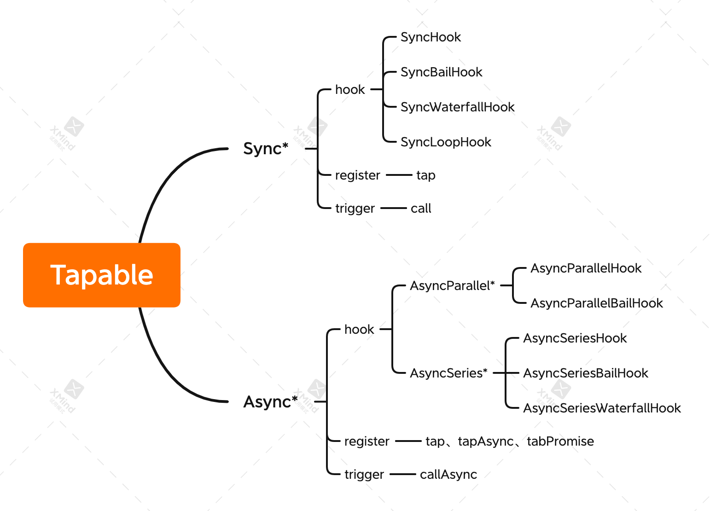

### 前言

Everything is a plugin in Webpack! 这是 ng-conf 在 2017 年举行的一场演讲，[Mastering Webpack From The Inside Out](https://www.youtube.com/watch?v=4tQiJaFzuJ8) 上所提出的理念。

Webpack 本质上是一种事件流机制，它内部的工作流程就是将各个插件串联起来的，而插件功能的核心就是 Tapable。Webpack 构建过程中最核心的两个对象：

- 负责整体编译流程的 compiler 对象
- 负责编译 module 的 compilation 对象

也都通过 Tapable 向外暴露了许多扩展插槽。

### Tapable

Tapable 是 Webpack 官方团队实现的一个基于发布-订阅模式的库，在 Webpack 构建过程中，最核心的两个对象 —— compiler 和 compilation 都通过 Tapable 向外暴露了许多扩展插槽。

#### 说明

Tapable 提供了两种类型的钩子，它们对应的注册和触发方式如下图所示：

所有钩子都接受一个类型为字符串数组的参数，而这个参数就是所有事件函数可用的形参列表。例子：

```javascript
const { SyncHook, AsyncSeriesHook } = require("tapable");

class Demo {
  constructor() {
    this.hooks = {
      // 这里将 ["arg1", "arg2", "arg3"] 作为参数传给了 AsyncSeriesHook
      // 后面注册到 run 上面的所有事件函数，都会有三个形参：arg1、arg2、arg3
      run: new AsyncSeriesHook(["arg1", "arg2", "arg3"]),
    };
  }
}

const demo = new Demo();
// run register
demo.hooks.run.tapAsync("run plugin", (arg1, arg2, arg3, cb) => {
  console.log("----- run plugin start -----");
  console.log(`arg1 is ${arg1}, arg2 is ${arg2}, arg3 is ${arg3}`);
  // 注意，这里 cb 必须调用。否则，后续的事件函数不会触发
  cb();
});
// run trigger
demo.hooks.run.callAsync("d", "e", "f", (err) => {
  if (err) {
    console.log(err);
    return;
  }
  console.log("----- plugin run okay -----");
});
```

上面的例子运行之后，输出结果如下：

```javascript
----- run plugin start -----
arg1 is d, arg2 is e, arg3 is f
----- plugin run okay -----
```

#### 原理
